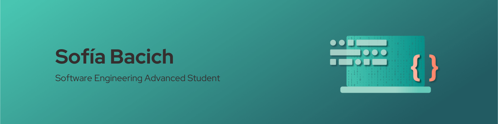

## Introduction

I’m a Software Engineering advanced student from UNDAV. I’m very passionate about the career and the fields of computer science, informatic, programming, logic, mathematics, etc. Therefore, I’m looking for new oportunities that will allow me to continue growing as a professional in these areas. 

## Objectives

My main objective is to gain more work-related technical and interdisciplinary experience, skills and knowledge, especially on Software Development.

## Languages

 English - Upper Intermediate 

 Spanish - Native 

## Tools
  <h4>• C++ </h4>
  <h4>• Python </h4>
  <h4>• Java </h4>
  <h4>• MySQL </h4>
  <h4>• PosgreSQL </h4>
  <h4>• MongoDB </h4>
  <h4>• Arduino/C </h4>

## Contact me
  
<a href="https://www.linkedin.com/in/sofiabacich/" target="_blank">

<a href="mailto:sbacich4366@gmail.com" target="_blank">

